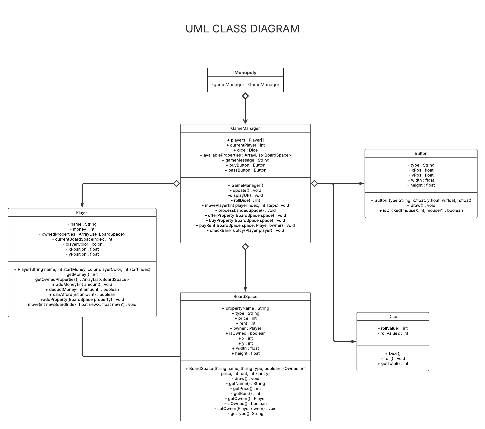

# Technical Details:

Period 3  
Stephen Chen, Ardian Agoes  
The Board Walkers

We are making a replica of the Monopoly board game. For our MVP, we plan on having a board (we could make our own monopoly board with CS related cards/properties), a token (circle or random shape) to represent players, random number generator button to simulate dice, as well as player UI to display properties bought, money, and current turn. Once a player lands on an unowned property, we will display a simple pop up asking if they want to buy it. If they land on a property owned by someone else, money will automatically be deducted. Once player money drops below 0, the player loses. No selling or mortgaging system in MVP. MVP will also not have houses/hotels, chance/community chest, property sets, auctions, trading, or jail. These will all be considered as extra features once MVP is met. Furthermore, complex animations for dice rolling, getting a double and an extra turn, figurines moving across the board will also be considered as extra features.  

# Project Design

UML Diagrams and descriptions of key algorithms, classes, and how things fit together.

We have five classes: Monopoly, GameManager, Player, BoardSpace, Dice, and Button

Our Monopoly class will be our main sketch and will just be initializing our GameManager and setting up the game, handling settings, the main game loop, and user input.  
Our GameManager class will be managing the flow of the game, player turns, and interactions between the player and the board (late between the players themselves).
&nbsp;work

# Intended pacing:

How you are breaking down the project and who is responsible for which parts.

MVP TIMELINE:

Create our own board (Ardian - 5/23)
Code Dice class and test (Ardian - 5/26)
Code Button class and test (Stephen - 5/23)
Code Board class and test (Ardian - 5/27)
Code Player class and test (Stephen - 5/26)
Compile everthing into GameManager class and make sure game logic works (Stephen - 5/28)
