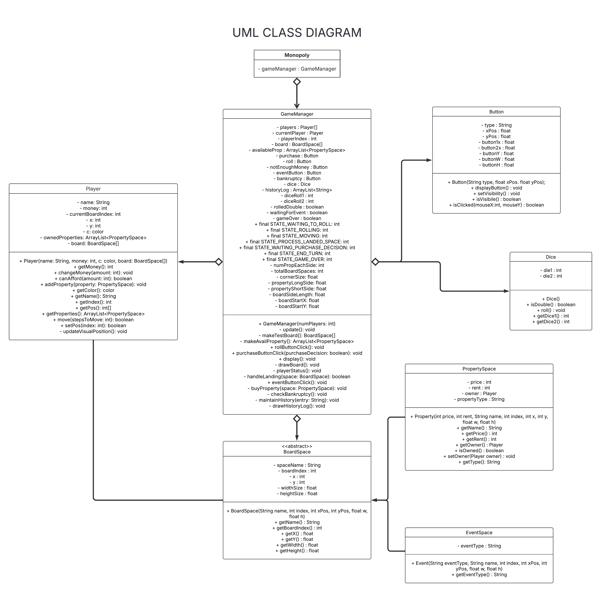

# Technical Details:

Period 3  
Stephen Chen, Ardian Agoes  
The Board Walkers

We are making a replica of the Monopoly board game. For our MVP, we plan on having a board (we could make our own monopoly board with CS related cards/properties), a token (circle or random shape) to represent players, random number generator button to simulate dice, as well as player UI to display properties bought, money, and current turn. Once a player lands on an unowned property, we will display a simple pop up asking if they want to buy it. If they land on a property owned by someone else, money will automatically be deducted. Once player money drops below 0, the player loses. No selling or mortgaging system in MVP. MVP will also not have houses/hotels, chance/community chest, property sets, auctions, trading, or jail. These will all be considered as extra features once MVP is met. Furthermore, complex animations for dice rolling, getting a double and an extra turn, figurines moving across the board will also be considered as extra features.  

# Project Design

UML Diagrams and descriptions of key algorithms, classes, and how things fit together.

## UML DIAGRAM VERSION #1 :  

## UML DIAGRAM VERSION #2 :  

## UML DIAGRAM VERSION #3 :  
 
We have eight classes: Monopoly, BoardSpace, GameManager, Player, EventSpace, PropertySpace, Dice, and Button  

* Our Monopoly class will be our main sketch and will just be initializing our GameManager and setting up the game, handling settings, the main game loop, and user input.  
* Our GameManager class will be managing the flow of the game, player turns, and interactions between the player and the board (late between the players themselves).  
    * >It will create the player objects, initialize the boardspaces, and create the dice. The methods within it are responsible for the main game loop (update()), displaying UI, dice rolling, property management, rent payments, and checking if a player has gone bankrupt. It will be interacting with the Player objects to update their state, with BoardSpace to get property details, Dice for rolls, and Button for user input.
    * >In our third UML version, we mainly added to our GameManager class as we realized that we were missing a lot of useful/necessary fields and methods for handling buttons, property, rent, and the different events.
* Our Player class will represent a player in the game and contain information about the player's status, assets, and current position.
    >The class will be used to initialize the player, managing money (add, deduct, canAfford), managing properties(addProperty(), getProperties()), and player movement across the board. It holds references to the BoardSpace objects it owns and will be interacting with the GameManasger for the different game events and for turn management.
* ~~Our BoardSpace class will be used to represent the different spaces on the Monopoly board and different properties.~~
    * >~~It will initialize the boardspaces and will contain many getters to for the GameManager to get access to the name, price, rent, and current owner of the property. It can also update the owner of the property. It will be interacting with the GameManager as the GameManager will be using BoardSpace to get details of the different properties~~
    * >We decided to make BoardSpace an abstract class to be implemented by two children classes, PropertySpace and EventSpace. We realized that by just having a BoardSpace class, it'll be harder to differentiate/work with both property and event spaces. This should help organize our code and make it easier to work with both on our board. 
* Our BoardSpace class will be an abstract class representing the blueprint of every space on our monopoly board, which either could be a property or some sort of event.
    * >The PropertySpace class will be used to create purchaseable spaces on the board, with different prices and rents (later, beyond our MVP, we will add sets, bonuses, mortgaging, etc.) It contains getters for the price, rent, owner, etc, and a setter for the game manager to update the owner of the property.
    * >The EventSpace class will be used to create event spaces on the board (non-ownable spaces) that trigger different game events/actions. For our MVP, this will just include "GO". We hope to later implement jail and cards (chance/community chest). It has a getter for the GameManager to access the event type of the space and will also implement the onLand() method to trigger the game logic associated with the space (Pass GO for $200 for example). The GameManager will be primarily using this method.
* Our Dice class will be used to simulate the rolling of two six-sided dice.
    >It will generate two random numbers between one and six and store them. It will also be used to get the total rolled. GameManager will be using Dice to get roll results.
* Our Button class will be a UI element for clickable buttons like "Buy" or "Pass".
    >It will take mouse coordinates and return if the player had clicked within the boundaries of the button. The GameManager will be using the class and displaying them when needed during different game events. It will also handle the visbility of the different buttons.    

# Intended pacing:

How you are breaking down the project and who is responsible for which parts.

MVP TIMELINE:

* ~~Create our own board (Ardian - 5/23)~~  
    >It would be better to use the BoardSpace class and draw it instead of making an image  
* Code Dice class and test (Ardian - 5/29) 
* Code Button class and test (Stephen - 5/27) 
* Code BoardSpace class and test (Ardian - 5/27) 
* Code PropertySpace class and test (Ardian - 5/29) 
* Code EventSpace class and test (Ardian - 5/29) 
* Code Player class and test (Stephen - 5/27) 
* Compile everthing into GameManager class and make sure game logic works (Stephen - 5/30) 
